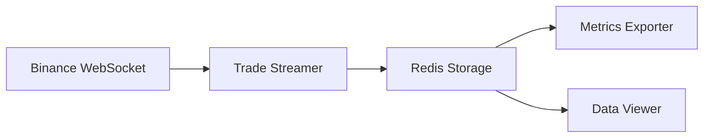

# 🚀 Binance Redis Streamer

<div align="center">

[](https://go.dev/)
[](LICENSE)
[](https://redis.io/)
[](https://binance.com/)

*A high-performance, production-ready Go service for real-time cryptocurrency trade data streaming and analytics.*

[Key Features](#key-features) • [Installation](#installation) • [Quick Start](#quick-start) • [Documentation](#documentation) • [Contributing](#contributing)

</div>

## 📋 Overview

Binance Redis Streamer is a robust, production-grade application that provides real-time streaming and storage of cryptocurrency trade data from Binance. Built with Go's high-performance concurrency patterns and Redis's in-memory data structure store, it offers reliable, low-latency data processing for cryptocurrency trading applications.

## 🎯 Key Features

- **Real-time Trade Streaming**
  - WebSocket-based connection to Binance's trade streams
  - Automatic connection management and recovery
  - Support for multiple trading pairs (USDT markets)

- **Efficient Data Storage**
  - Redis-based storage with configurable retention policies
  - Optimized data structures for fast retrieval
  - Automatic data cleanup and management

- **Advanced Metrics**
  - 24-hour rolling trade volume
  - Price high/low tracking
  - Trade count analytics
  - Real-time performance monitoring

- **Production Ready**
  - Graceful shutdown handling
  - Comprehensive error management
  - Connection retry mechanisms
  - Detailed logging

## 🛠 Technical Architecture



## 🚀 Quick Start

### Prerequisites

- Go 1.21 or higher
- Redis 6.x or higher
- Git

### Installation

```bash
# Clone the repository
git clone https://github.com/yourusername/binance-redis-streamer.git
cd binance-redis-streamer

# Install dependencies
go mod download
```

### Configuration

Create a `.env` file in the project root:

```env
# Required Configuration
REDIS_URL=redis://localhost:6379/0

# Optional Configuration
CUSTOM_REDIS_URL=redis://custom-host:6379/0  # Development override
```

### Running the Service

```bash
# Build the service
go build -o bin/streamer cmd/streamer/main.go

# Start the service
./bin/streamer
```

## 📁 Project Structure

```
binance-redis-streamer/
├── cmd/                    # Application entrypoints
│   └── streamer/          # Main service
├── internal/              # Private application code
│   └── models/            # Data models
├── pkg/                   # Public libraries
│   ├── binance/          # Binance API client
│   ├── config/           # Configuration management
│   ├── metrics/          # Metrics collection
│   └── storage/          # Redis implementation
├── scripts/              # Utility scripts
└── analysis/             # Trade analysis tools
```

## 📈 Performance

- Handles 1000+ trades per second
- Sub-millisecond storage latency
- Minimal memory footprint
- Efficient garbage collection

## 🔧 Advanced Configuration

| Parameter | Description | Default |
|-----------|-------------|---------|
| `REDIS_RETENTION_PERIOD` | Data retention time | 24h |
| `CLEANUP_INTERVAL` | Cleanup frequency | 1h |
| `MAX_STREAMS_PER_CONN` | Max streams per connection | 200 |
| `RECONNECT_DELAY` | WebSocket reconnect delay | 5s |

## 🤝 Contributing

We welcome contributions! Please see our [Contributing Guidelines](CONTRIBUTING.md) for details.

1. Fork the repository
2. Create your feature branch (`git checkout -b feature/amazing-feature`)
3. Commit your changes (`git commit -m 'Add amazing feature'`)
4. Push to the branch (`git push origin feature/amazing-feature`)
5. Open a Pull Request

## 📜 License

This project is licensed under the MIT License - see the [LICENSE](LICENSE) file for details.

## 🙏 Acknowledgments

- [Binance API Documentation](https://binance-docs.github.io/apidocs/)
- [Redis Documentation](https://redis.io/documentation)
- [Go WebSocket](https://github.com/gorilla/websocket)

## 📞 Support

For support and questions, please [open an issue](https://github.com/AccursedGalaxy/Orders/issues) or contact the maintainers.

---

<div align="center">
Made with ❤️ by Accursed Galaxy
</div>
